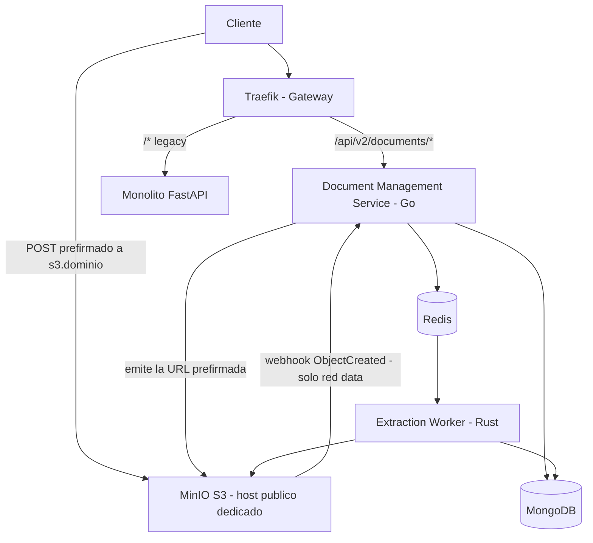

# infra

Repositorio de infraestructura del proyecto de migración a microservicios (ver `docs/SPEC.md` v2.1).

## Qué hace este repo

Contiene todo lo necesario para levantar y operar la plataforma de soporte a los servicios:

- `docker-compose.yml` (Compose v2) con perfiles **`core`** (MongoDB + Redis + MinIO), **`full`** (+ Traefik, Prometheus, Grafana/Loki) y **`chaos`** (utilidades para pruebas de fallo).
- Configuración de **Traefik** (entrypoint único, ACME, routers), **MinIO**, **Redis** (AOF + futuro Sentinel) y **MongoDB** (Replica Set).
- `scripts/bootstrap.sh` para verificar toolchains (Docker, Go, Rust, `mc`, `trivy`, `gitleaks`).
- Runbooks operativos (`runbooks/`) y **ADRs globales** (`docs/adr/`).

## Qué NO hace este repo

- **No contiene código de aplicación**: el Document Management Service vive en `doc-service/` (Go), el Extraction Worker en `extraction-worker/` (Rust) y el `rate-limiter` + arnés de pruebas en `platform-services/`.
- **No contiene secretos reales**: solo `.env.example` con valores ficticios. Los secretos viven en el gestor de secretos del entorno, nunca en este repo (que es **público**).
- **No expone datos directamente a internet**: los servicios de datos viven en la red `data` sin salida externa (ver `S0-P1-05`).

## Arquitectura (visión general, SPEC §2)



## Cómo se usa

```bash
# 1. Verificar toolchains del entorno
./scripts/bootstrap.sh

# 2. Copiar y completar variables (nunca commitear el .env real)
cp .env.example .env

# 3. Levantar solo los datos
docker compose --profile core up -d

# 4. Levantar el stack completo
docker compose --profile full up -d
```

## Gobernanza

- Rama `main` protegida por **ruleset**: push directo y force push denegados, PR obligatorio con CI en verde y al menos 1 aprobación.
- Todo PR usa la plantilla de 4 secciones: *qué cambia · por qué · cómo se prueba · cómo se revierte*.
- Las ADRs en `docs/adr/` requieren revisión de los 4 integrantes (ver `CODEOWNERS`).
- **⚠️ Repo público:** no commitear secretos, IPs internas ni datos sensibles. La protección contra secretos (push protection) está habilitada, pero la disciplina es la primera defensa.
