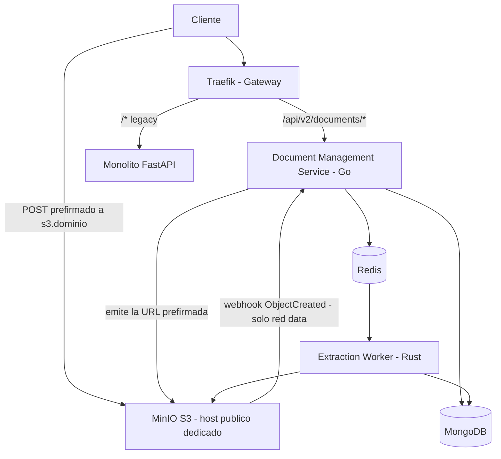

# infra

Repositorio de infraestructura del proyecto de migración a microservicios (ver `docs/SPEC.md` v2.1).

## Qué hace este repo

Contiene todo lo necesario para levantar y operar la plataforma de soporte a los servicios:

- `compose/docker-compose.yml` (Compose v2) con perfiles **`core`** (MongoDB RS + Redis ×2 + MinIO), **`full`** (+ Traefik, monolito detrás del gateway, Prometheus, Grafana/Loki) y **`chaos`** (utilidades para pruebas de fallo).
- Configuración de **Traefik** (`traefik/`), **MinIO**, **Redis** (AOF streams + LRU ratelimit) y **MongoDB** (Replica Set `rs0`).
- `scripts/bootstrap.sh` (verificación de toolchains), `scripts/gen-certs.sh` (TLS local con mkcert) y `scripts/verify-networks.sh` (topología).
- Runbooks operativos (`runbooks/`) y **ADRs globales** (`docs/adr/`, incluida **ADR-0016**: host dedicado de S3).

## Qué NO hace este repo

- **No contiene código de aplicación**: el Document Management Service vive en `doc-service/` (Go), el Extraction Worker en `extraction-worker/` (Rust) y el `rate-limiter` + arnés de pruebas en `platform-services/`.
- **No contiene secretos reales**: solo `.env.example` con valores ficticios. Los secretos viven en el gestor de secretos del entorno, nunca en este repo (que es **público**).
- **No expone datos directamente a internet**: los servicios de datos viven en la red `data` sin salida externa (ver `S0-P1-05`).

## Arquitectura (visión general, SPEC §2)



## Cómo se usa

```bash
# 1. Verificar toolchains del entorno
./scripts/bootstrap.sh

# 2. Copiar y completar variables (nunca commitear el .env real)
cp .env.example .env   # y completar valores

# 3. Generar TLS local (mkcert) — ver docs/adr/ADR-0016.md
./scripts/gen-certs.sh

# 4a. Solo datos (P2/P3)
docker compose -f compose/docker-compose.yml --env-file .env --profile core up -d

# 4b. Stack completo (gateway + monolito + observabilidad)
docker compose -f compose/docker-compose.yml --env-file .env --profile full up -d

# 5. Verificar la topologia de redes
./scripts/verify-networks.sh
```

## Topología de redes (S0-P1-05)

| Red      | `internal` | Quién vive ahí                                     |
|----------|------------|-----------------------------------------------------|
| `edge`   | no         | Solo **Traefik** (punto de entrada público)         |
| `internal` | sí       | Monolito, futuros doc-service / worker / rate-limiter |
| `data`   | sí         | MongoDB, Redis ×2, MinIO (tráfico interno)          |

Traefik pertenece a las tres (necesita alcanzar los backends); **ningún servicio de
datos tiene ruta a internet** — verificación: `./scripts/verify-networks.sh`.

Los dos **hostnames locales** (variante de ADR-0016): `api.localhost` (control, →
monolito hoy, → doc-service en `/api/v2/documents/*` cuando exista) y `s3.localhost`
(datos, → MinIO :9000; la consola :9001 **nunca** se enruta).

## Mapa de puertos locales

| Puerto | Servicio    | Nota                                  |
|--------|-------------|---------------------------------------|
| 80     | Traefik     | Redirige 308 → 443 (`TRAEFIK_HTTP_PORT` en `.env`) |
| 443    | Traefik     | TLS mkcert: api.localhost, s3.localhost (`TRAEFIK_HTTPS_PORT`) |
| 9090   | Prometheus  | UI local                              |
| 3000   | Grafana     | UI local                              |

MongoDB, Redis y MinIO **no** publican puertos al host (solo redes internas).

## Notas de plataforma verificadas

- **Imagen MinIO:** la oficial `minio/minio` puede no estar accesible desde algunos
  entornos (Docker Hub deniega el pull anónimo). Se usa `bitnamilegacy/minio` con tag
  inmutable, funcionalmente equivalente para dev. Ver comentario en el compose.
- **Traefik v3.7:** se requiere una versión reciente si el daemon de Docker exige
  API ≥ 1.40 (el cliente pinneado de v3.4 falla con dichos daemons).
- **MongoDB con auth + Replica Set** requiere `compose/mongo/keyfile` (generado por
  `openssl rand -base64 756`, dueño `999:999`, modo `400`; en `.gitignore`).

## Dockerfiles del proyecto (regla de supply-chain, S0-P1-04.2)

Plantilla de referencia obligatoria para los Dockerfiles de `doc-service` y
`extraction-worker` (llegan en S3). Todo Dockerfile del proyecto cumple:

1. **Pin por digest** en la imagen base: `FROM golang:1.24.4@sha256:<digest>`,
   nunca `latest` ni tag mutable solo. El tag acompaña como documentación; el
   digest es lo que ancla el build.
2. **Multi-stage build**: la imagen final no contiene toolchain de compilación
   (Go/Cargo), solo el binario y sus dependencias mínimas de runtime
   (`gcr.io/distroless` o `debian:xx-slim@sha256:...`).
3. **Usuario no-root**: `USER` explícito con UID/GID creado en el stage final,
   nunca 0. Complementar con `read_only`, `cap_drop: ALL` y
   `no-new-privileges` en el compose/k8s que lo despliegue.

Además: escaneo de la imagen resultante con `trivy` en CI antes de firmarla,
y escaneo de secretos del repo con `gitleaks` (pre-commit + job de CI en
`.github/workflows/gitleaks.yml`).

## Escaneo de secretos (gitleaks, S0-P1-04)

Defensa en dos capas:

- **Local (primera capa):** hook de pre-commit por clone. Ejecutar **una vez**
  en cada repositorio del proyecto:

  ```bash
  gitleaks install   # registra .git/hooks/pre-commit en este clone
  ```

  El hook vive en `.git/hooks` (no se versiona): `scripts/bootstrap.sh` lo
  registra automáticamente en este repo si `gitleaks` está instalado.
- **CI (segunda capa):** job `gitleaks` (`.github/workflows/gitleaks.yml`) que
  escanea el diff de cada PR y cada push a `main`. Repo público: no requiere
  licencia ni token extra.

## Gobernanza

- Rama `main` protegida por **ruleset**: push directo y force push denegados, PR obligatorio con CI en verde y al menos 1 aprobación.
- Todo PR usa la plantilla de 4 secciones: *qué cambia · por qué · cómo se prueba · cómo se revierte*.
- Las ADRs en `docs/adr/` requieren revisión de los 4 integrantes (ver `CODEOWNERS`).
- **⚠️ Repo público:** no commitear secretos, IPs internas ni datos sensibles. La protección contra secretos (push protection) está habilitada, pero la disciplina es la primera defensa.
