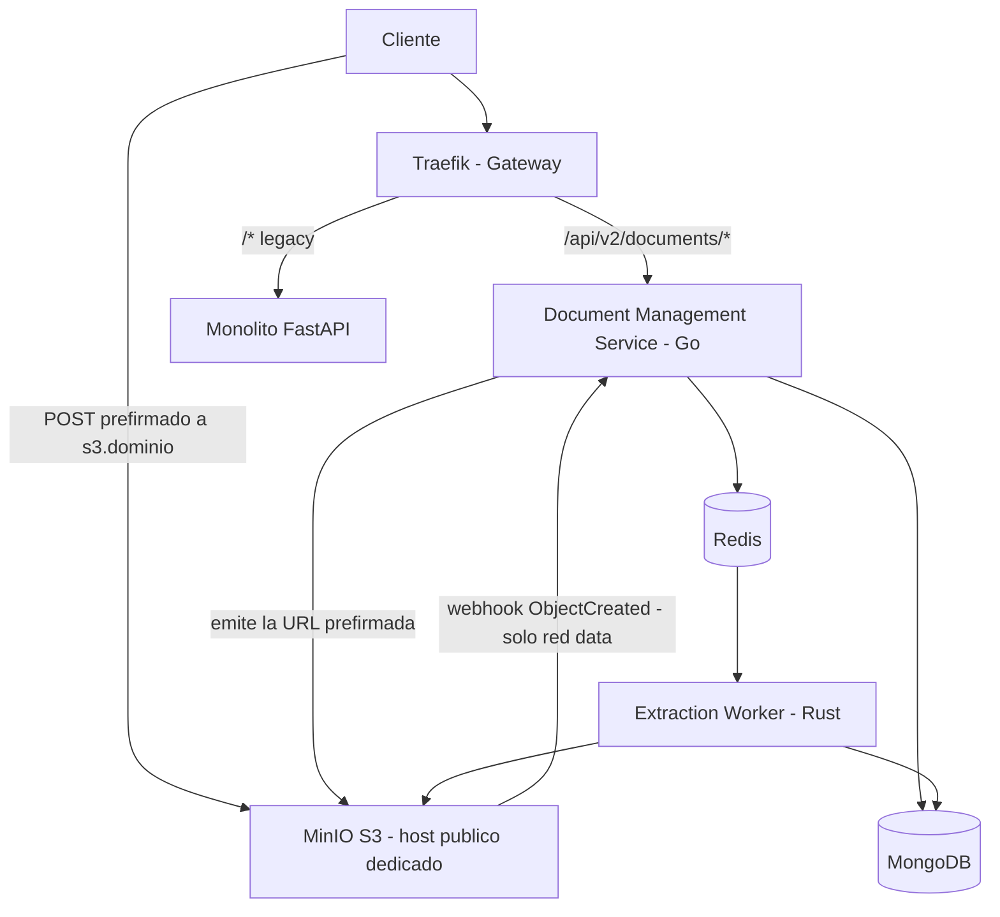
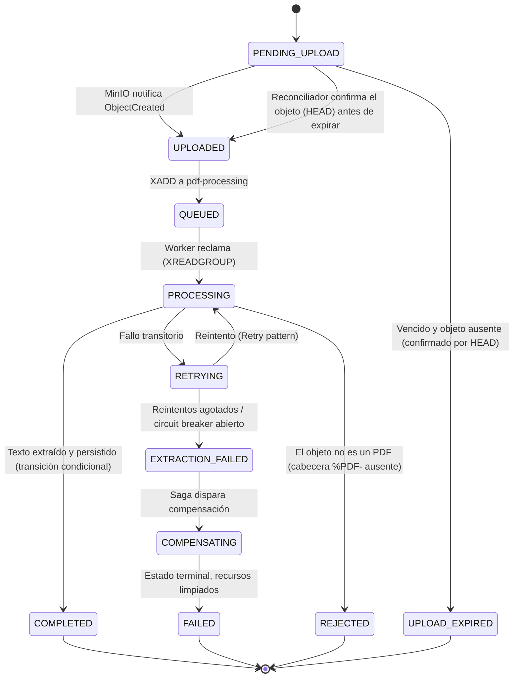
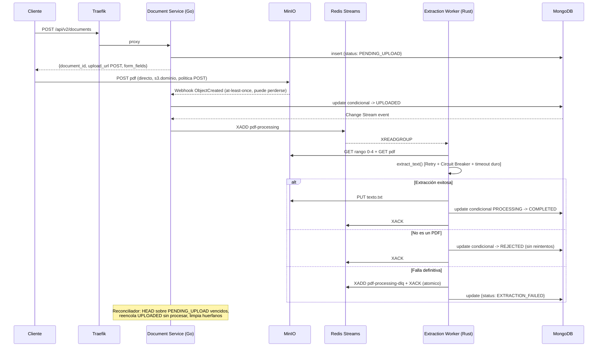

# Software Design Description (SDD) - Migración a Microservicios

**Versión:** 2.1 (Refactor con patrón SAGA)
**Estándar de referencia:** IEEE 1016

> **Cambios en 2.1** (aplicados *antes* de congelar los contratos de `pasos-iniciales.md`):
> 1. La meta de resiliencia se reformula: la garantía es **todo documento alcanza un estado terminal**, no "0 mensajes perdidos en Redis" (§1.3).
> 2. El límite de tamaño del **PDF** se impone en el servidor de objetos (política `POST` prefirmada), no en el gateway (§3.1, §5.1, §9).
> 3. **Hostname público dedicado para MinIO S3** (la firma SigV4 depende del host) y nuevo estado terminal `REJECTED` (§2, §4, §5.1, §9).
> 4. La validación `%PDF-` pasa a **después** de la subida, con `GET` por rango (§9).
> 5. Orden explícito entre el TTL de Mongo y `UPLOAD_EXPIRED`: decide el reconciliador con un `HEAD`, el TTL borra después (§4, §6.3, §6.5).
> 6. El webhook de MinIO es *at-least-once* y puede perderse: "reduce la ventana", no "garantiza" (§5.2).
> 7. Contador de intentos desde `XPENDING` y `XACK` + `XADD` a la DLQ atómico (§5.4).
> 8. Hardening de parseo de PDF en el worker (§3.3).
> 9. Clientes Redis **Sentinel-aware** y `WAIT` tras el `XADD` para acortar la ventana de pérdida (§3.5).
> 10. Se acepta y se acota explícitamente que el worker escriba el estado terminal en Mongo (ADR-0006) (§6.3).
> 11. Fase nueva de **migración de clientes con fecha límite** (§13).
> 12. Autoescalado: en Docker Compose no hay HPA; alerta + escala manual documentada y autoscaling real diferido a una ADR futura (§11).

---

## 1. Introducción y Objetivos

### 1.1 Propósito
Describir el diseño arquitectónico para migrar el monolito actual (FastAPI/Python) hacia una arquitectura de microservicios mediante el **Patrón Estrangulador (Strangler Fig)**, agregando garantías de consistencia distribuida mediante el **patrón SAGA**.

### 1.2 Alcance
El monolito actual resuelve, de forma acoplada:
- Validación de que el archivo sea un PDF válido y no exceda el tamaño límite.
- Extracción de texto del PDF.
- Generación y devolución de un `.txt`.
- Persistencia de metadatos en MongoDB.
- Orquestación del flujo completo.

La migración separa esto en tres servicios independientes, cada uno en su propio repositorio:

| Servicio | Lenguaje | Responsabilidad |
|---|---|---|
| API Gateway | Traefik v3 | Enrutamiento, TLS, rate limiting, punto único de entrada |
| Document Management Service | Go (Gin) | CRUD de metadatos, ciclo de vida del documento, orquestador de la SAGA |
| Extraction Worker Service | Rust (Actix/Tokio) | Consumo de la cola, extracción de texto, generación del `.txt` |

### 1.3 Metas Técnicas

| Objetivo | Métrica |
|---|---|
| Desacoplamiento | Cero llamadas síncronas directas entre Document Service y Extraction Worker |
| Escalabilidad | Escalado horizontal independiente del worker según profundidad de cola |
| Resiliencia | 99.95% disponibilidad de la API síncrona; **todo documento alcanza un estado terminal** — los mensajes de Redis pueden perderse en un failover de Sentinel y el reconciliador los recupera desde el estado en Mongo (§6.5) |
| Consistencia | Todo documento converge a un estado terminal (`COMPLETED` o `FAILED`), nunca queda "colgado" indefinidamente |
| Rendimiento | <500ms p95 en endpoints síncronos (no incluye el procesamiento asíncrono del PDF) |

### 1.4 Nota sobre el stack tecnológico
Se respetan las tecnologías ya decididas (Traefik, MinIO, Redis, Redis Streams, Go, Rust, Retry, Circuit Breaker). Las observaciones de este documento son correcciones de **cómo se usan** esas tecnologías y adiciones de patrones, no reemplazos de stack. Donde exista una alternativa más simple usando lo que ya se eligió, se señala explícitamente con 🔧 **Recomendación**.

---

## 2. Visión Arquitectónica General

- **Estrategia de migración**: Strangler Pattern, multi-repo.
- **Estilo**: Arquitectura orientada a eventos con orquestación explícita de la SAGA en el Document Management Service (es el dueño natural del ciclo de vida del documento).
- **Principio organizativo**: Inverse Conway Maneuver — cada equipo es dueño de un servicio y su stack.



- El cliente habla con **dos hostnames distintos**: `api.dominio` (control, por Traefik) y `s3.dominio` (datos, directo a MinIO). La separación es obligatoria, no estética: la firma SigV4 depende del *host* (§5.1).

---

## 3. Diseño de Componentes

### 3.1 API Gateway (Traefik)

| Función | Tecnología | Justificación |
|---|---|---|
| Enrutamiento / Strangler routing | Traefik v3 | Service discovery dinámico, reglas por path/header |
| TLS Termination | ACME (Let's Encrypt) integrado en Traefik | Emisión y renovación automática de certificados; OpenSSL se usa solo para generar CA/certs internos si se decide mTLS entre servicios |
| Rate Limiting distribuido | Redis (vía plugin o ForwardAuth) | Ver sección 8 — el middleware nativo de Traefik OSS **no** es distribuido |
| Límite de tamaño de request — **solo endpoints JSON** | Middleware `buffering` de Traefik | Límite chico (~1 MB) en las rutas JSON: rechaza payloads sobredimensionados **antes** de llegar al servicio, ahorrando cómputo. El PDF **no pasa por el gateway** (§5.1), así que un límite grande ahí no protege nada y solo agrega latencia |

> 🔧 **Corrección importante:** el middleware nativo `RateLimit` de Traefik es **por instancia** (en memoria), no comparte estado entre réplicas aunque haya un Redis al lado. Ver sección 8 para la solución correcta.
>
> 🔧 **Corrección sobre el límite de tamaño:** el límite del **PDF** no se impone en Traefik. Como la subida va directa a MinIO (§5.1), el gateway nunca ve esos bytes: un `buffering` de 25 MB solo penaliza el tráfico JSON real. El límite del PDF se impone en el **servidor de objetos**, con la condición `content-length-range` de la política `POST` prefirmada (§5.1, §9), y el Document Service lo repite al emitir la URL como defensa en profundidad.

### 3.2 Document Management Service (Go)

| Característica | Tecnología | Justificación |
|---|---|---|
| Framework | Gin | Bajo overhead, alto throughput de I/O |
| Acceso a datos | **Mongo Go Driver** (no es un ORM; MongoDB es un driver oficial sin capa ORM) | Tipado explícito de structs/BSON |
| Concurrencia | Goroutines | Manejo eficiente de I/O concurrente (Mongo, MinIO, Redis) |
| Rol adicional | **Orquestador de la SAGA** (sección 6) | Es el dueño del agregado "documento"; centraliza el estado |
| Contenedor | Docker, usuario no-root | Reduce superficie de ataque |

### 3.3 Extraction Worker Service (Rust)

| Característica | Tecnología | Justificación |
|---|---|---|
| Runtime async | Tokio | Procesamiento no bloqueante, ideal para I/O con MinIO/Redis |
| Framework HTTP (solo health/metrics) | Actix-web | Expone `/healthz`, `/readyz`, `/metrics` |
| Extracción de PDF | `pdf-extract` o `lopdf` | Rendimiento nativo, seguridad de memoria |
| Métricas | Prometheus (`metrics` crate) | Observabilidad de latencia de extracción y profundidad de cola |
| Concurrencia interna | Semáforo (Bulkhead) para limitar extracciones simultáneas por instancia | Evita agotar CPU/RAM al recibir ráfagas de mensajes |
| Límites de parseo (hardening) | **Timeout duro por trabajo**, tope de páginas, tope de bytes de salida y memoria acotada | Un PDF hostil (millones de páginas, zip-bomb, fuentes malformadas, tabla de referencias que no termina) no puede colgarse ni tumbar la instancia: se come su presupuesto y muere |
| Aislamiento del parseo | **A evaluar**: ejecutar la extracción en un subproceso (o `spawn` con `kill_on_drop`) | Un fallo nativo del decoder (segfault, OOM, loop infinito) mata al subproceso y no al worker; además permite matar el trabajo al vencer el timeout duro en lugar de solo dejar de esperarlo |

### 3.4 MinIO (almacenamiento binario)

Dos buckets con políticas de acceso separadas (principio de mínimo privilegio, no una sola access key compartida):

| Bucket | Escritores | Lectores | Retención sugerida |
|---|---|---|---|
| `raw-pdfs` | Cliente (vía URL prefirmada) | Extraction Worker | Lifecycle policy: eliminar tras N días o al completar el procesamiento |
| `extracted-txt` | Extraction Worker | Document Service, Cliente (descarga) | Según requisitos de negocio |

### 3.5 Redis (cache + mensajería)

🔧 **Recomendación de separación lógica:** Redis atiende dos cargas de trabajo con requisitos distintos:
- **Rate limiting**: datos efímeros, se puede perder sin consecuencias graves, no necesita persistencia.
- **Redis Streams (cola de trabajo)**: datos que **no deben perderse** (representan PDFs pendientes de procesar).

Usar la misma instancia sin persistencia (`appendonly no`) arriesga perder trabajos encolados ante un reinicio. Se recomienda:
- Habilitar **AOF** (`appendonly yes`, `appendfsync everysec`) en la instancia que aloja los Streams.
- Si el presupuesto de infraestructura lo permite, usar **Redis Sentinel** (alta disponibilidad) para el Redis de Streams, dado que es punto único de fallo para todo el pipeline de procesamiento. Esto sigue siendo "Redis", no un cambio de tecnología.

🔧 **Corolario obligatorio de usar Sentinel: los dos clientes (Go y Rust) tienen que ser Sentinel-aware.** "Apuntar al primario" no es suficiente:

- Resolver el primario **en cada reconexión** (y periódicamente en background) a través de Sentinel, con la lista de Sentinels configurada y descubrimiento de la IP nueva después de un failover.
- Reconectar con backoff y *jitter*: durante el failover las conexiones se caen y hay que **reescribir el destino**, no solo reintentar la operación.
- **Probarlo, no suponerlo**: matar el primario en la prueba de failover y verificar que *ambos* clientes reconectan solos y siguen escribiendo. Un cliente que no es Sentinel-aware funciona perfecto en las pruebas de integración y se cae en producción el día del failover.

🔧 **Acortando la ventana de pérdida con `WAIT`:** la replicación de Sentinel es asíncrona, así que un failover puede perder los `XADD` no replicados todavía. Mitigación barata y de bajo costo: ejecutar **`WAIT 1 <timeout_ms>`** justo después del `XADD` en el relay, de modo que el mensaje esté replicado en al menos una réplica antes de que el Document Service lo considere encolado. No agrega latencia al request del cliente (que ya respondió) y reduce la ventana de pérdida a casi cero; el resto de la compensación la da el reconciliador (§6.5), que es quien convierte esa medida de reducción en garantía de convergencia.

### 3.6 MongoDB (persistencia de metadatos)

- Debe correr como **Replica Set** (incluso de un solo nodo en dev) para poder usar **transacciones multi-documento** y **Change Streams** (clave para la SAGA, sección 6).
- Usuario de aplicación con permisos `readWrite` acotados a su base, nunca `root`/`admin`.

---

## 4. Ciclo de Vida del Documento (Máquina de Estados)

Antes de hablar de mensajería, se define explícitamente el ciclo de vida — esto es la base sobre la que se construye la SAGA:



Estados terminales: `COMPLETED`, `FAILED`, `REJECTED` y `UPLOAD_EXPIRED`. Nada sale de ellos.

🔧 **`REJECTED`: estado terminal que evita un ciclo de reintentos inútil.** Si el objeto subido no es un PDF (§9), el resultado no va a cambiar por reintentarlo: cada intento es exactamente la misma extracción fallando sobre el mismo objeto. Se registra `REJECTED` con causa (`NOT_A_PDF`) y **no** pasa por `RETRYING` ni por la DLQ. La distinción con `EXTRACTION_FAILED` es semántica y útil en soporte: `REJECTED` = la entrada nunca fue un documento procesable (el problema es del cliente), `EXTRACTION_FAILED` = la entrada era válida pero no se pudo procesar y se agotaron los reintentos (con compensación y limpieza de recursos).

🔧 **El TTL no decide el expirado: decide el reconciliador.** El índice TTL de Mongo borra el documento pasado `expires_at`, y ese borrado es irreversible. Si el TTL borrara el registro mientras el objeto **sí** está subido en MinIO —porque se perdió el webhook— el usuario pierde su documento en silencio y además queda un objeto huérfano que nadie va a reclamar. Por eso el orden es explícito:

1. `expires_at` se calcula como **ventana de subida + gracia** (≥ 2× el intervalo del reconciliador), para que el registro sobreviva lo suficiente como para poder ser evaluado.
2. El job de reconciliación (§6.5) recorre los `PENDING_UPLOAD` vencidos, hace **`HEAD` del objeto** y decide: si existe, lo **promociona a `UPLOADED`** (y limpia o extiende `expires_at`); si no existe, lo marca `UPLOAD_EXPIRED`.
3. Recién entonces el TTL cumple su papel: recolectar registros **ya decididos**, sin riesgo de tragarse trabajo válido.

Cada transición se persiste en MongoDB (`documents.status`) con timestamp, de modo que el estado del documento sea siempre consultable por el cliente vía `GET /documents/{id}`.

---

## 5. Comunicación y Flujo de Datos

### 5.1 Subida directa vía URL prefirmada (presigned URL)

🔧 **Recomendación de eficiencia:** en vez de que el binario del PDF atraviese Traefik → Document Service → MinIO (triple hop para un archivo binario grande), el Document Service genera una **URL prefirmada de MinIO** y el cliente sube el PDF **directamente** a MinIO.

Beneficios:
- El Document Service nunca carga el binario en memoria/red propia → menor uso de recursos y mejor cumplimiento del objetivo <500ms p95 en el endpoint síncrono.
- MinIO ya soporta esto de forma nativa (no es tecnología nueva).

🔧 **Corrección: la URL prefirmada es de tipo `POST` con política, no de tipo `PUT` (ADR-0011).** Con `PUT` prefirmado no se puede imponer ninguna condición sobre el objeto: la firma solo autoriza *una* escritura en *una* clave, y ni el tamaño ni el tipo quedan restringidos en el servidor de objetos. Con **`POST` prefirmado con política** se incluyen condiciones que MinIO evalúa antes de escribir:

```json
{
  "expiration": "2026-11-30T10:30:00Z",
  "conditions": [
    ["content-length-range", 1, 26214400],
    ["eq", "$Content-Type", "application/pdf"],
    ["eq", "$key", "raw-pdfs/<document_id>.pdf"]
  ]
}
```

Efectos: un PDF de más de 25 MB recibe `EntityTooLarge` **de MinIO**, no un éxito silencioso; el `Content-Type` queda fijado; y la clave queda amarrada al `document_id`. Esto es lo que convierte el límite de tamaño en una regla del servidor de objetos y no en un `buffering` del gateway (§3.1, §9).

🔧 **El host de MinIO debe ser un hostname público dedicado (ej. `s3.dominio`), no el mismo dominio que la API.** La firma SigV4 que genera MinIO **incluye el host** dentro del *canonical request*: las mismas claves y las mismas cabeceras producen firmas distintas para `api.dominio` y para `s3.dominio`. Si el host de la URL prefirmada no coincide exactamente con el host al que el cliente golpea, la verificación falla con `SignatureDoesNotMatch` — y el síntoma (un 403 en el cliente con la API perfectamente sana) es de los más difíciles de diagnosticar en producción. Además permite aplicar políticas distintas a cada router del gateway y deja la superficie del servidor de objetos separada de la de la API.

Flujo:
1. `POST /api/v2/documents` → Document Service valida tamaño y metadata, inserta `{status: PENDING_UPLOAD}` en Mongo (idempotency key = `document_id`, ej. ULID) y emite una **URL prefirmada `POST`** de MinIO con política.
2. Responde con `{document_id, upload_url, method: "POST", form_fields, required_headers, expires_in}`.
3. Cliente hace `POST` directo a `https://s3.dominio/raw-pdfs` con la URL y los `form_fields` (`key`, `policy`, `x-amz-signature`, `Content-Type`) en un `multipart/form-data` estándar de S3.
4. MinIO valida la política, escribe el objeto y dispara el webhook (§5.2).

### 5.2 Notificación de eventos de MinIO (reemplaza el "dual write")

El diagrama original hacía esto en dos pasos independientes y no atómicos:
```
DocumentService->MinIO: store_pdf()
DocumentService->Redis: XADD tasks   <-- si esto falla, el PDF queda huérfano
```

🔧 **Corrección:** en lugar de que el propio servicio escriba a MinIO y *además* recuerde encolar el mensaje (dos operaciones que pueden fallar independientemente), se usa **MinIO Bucket Notifications** (target *webhook*, soportado nativamente por MinIO) sobre el evento `s3:ObjectCreated:Put` del bucket `raw-pdfs`:

```
MinIO --(webhook, objeto confirmado en disco)--> POST /internal/documents/{id}/uploaded (Document Service)
```

Esto **reduce la ventana** en la que la clase de fallo "subí el archivo pero nadie se enteró" puede ocurrir: la actualización de estado y el encolado **solo ocurren si el objeto realmente existe en MinIO**.

No la elimina, y conviene ser explícito sobre por qué:

- La entrega es **at-least-once**: el mismo evento puede llegar más de una vez, incluso en paralelo. Por eso el handler es idempotente y deduplica.
- La entrega **puede perderse**: MinIO no reintenta de manera confiable, y si el Document Service está caído, sin salida a la red de datos o sin permisos en ese instante, el evento se pierde. Un evento perdido deja el documento en `PENDING_UPLOAD` **con el objeto ya subido**.
- La red de seguridad de ese caso es el **reconciliador** (§6.5), que hace `HEAD` del objeto y promueve a `UPLOADED` lo que se subió y no se notificó (§4).

Por eso la redacción correcta es "reduce la ventana". La garantía del sistema no es la entrega del evento, es la **convergencia a un estado terminal** (§1.3), y eso se sostiene porque existe el reconciliador, no porque el webhook sea confiable.

### 5.3 De MongoDB a Redis Streams sin "dual write": Change Streams

El paso "actualizar Mongo a `UPLOADED`" y "hacer `XADD` en Redis" siguen siendo dos sistemas distintos. Para no reintroducir el mismo problema de escritura dual:

🔧 **Recomendación:** usar **MongoDB Change Streams** (ya viene incluido al usar MongoDB como Replica Set, no es tecnología nueva) en vez de implementar manualmente un patrón *Transactional Outbox* con tabla y poller propios.

- El handler del webhook de MinIO hace **una sola escritura**: `updateOne({_id: document_id, status: "PENDING_UPLOAD"}, {$set: {status: "UPLOADED"}})`, con filtro de estado esperado como el resto de las transiciones.
- Un *relay* (goroutine dentro del propio Document Service, no requiere un servicio nuevo) escucha el Change Stream de la colección `documents` filtrando por `status: "UPLOADED"`, y hace `XADD pdf-processing {...}` seguido de **`WAIT 1`** para que el mensaje esté replicado antes de considerarlo encolado (§3.5).
- El *resume token* del Change Stream se persiste (en una colección chica de Mongo o en Redis) para no perder eventos si el proceso se reinicia.

Esto resuelve el problema de "doble escritura" (DB + cola) sin 2PC y sin componentes adicionales, apoyándose en tecnología ya elegida.

### 5.4 Redis Streams: colas, consumer groups y Dead Letter Queue

```
Stream:          stream:pdf-processing
Consumer Group:  extraction-workers
DLQ:             stream:pdf-processing-dlq
```

- Alta: `XADD stream:pdf-processing * document_id <id> object_key raw-pdfs/<id>.pdf correlation_id <id> schema_version 1` — **sin `attempts`** (ver abajo).
- Cada worker: `XREADGROUP GROUP extraction-workers consumer-<pod> COUNT 1 BLOCK 5000 STREAMS stream:pdf-processing >`
- Éxito: `XACK`
- Fallo: **no** se hace `XACK` → el mensaje queda en el *Pending Entries List* (PEL).
- Recuperación de mensajes huérfanos (worker caído a mitad de proceso): `XAUTOCLAIM` periódico para reasignar el mensaje a otro consumidor.
- Al superar el máximo de intentos (ej. 5), el mensaje se mueve a `stream:pdf-processing-dlq` y el documento pasa a `EXTRACTION_FAILED` (dispara la compensación, sección 6).

🔧 **El contador de intentos es el *delivery count* de `XPENDING`, no un campo del mensaje.** Redis ya lleva la cuenta de cuántas veces entregó un mensaje pendiente y la incrementa solo en cada `XREADGROUP` y en cada `XAUTOCLAIM`. Llevar `attempts` en el payload obliga a **reescribir el mensaje dentro del stream** en cada intento para mantener un contador que ya existe: más escrituras sobre el path crítico, más superficie de fallo y un mensaje que cambia bajo los pies del consumidor. Se lee con `XPENDING stream:pdf-processing extraction-workers IDLE 0 - + 100` y se compara contra `WORKER_MAX_ATTEMPTS`.

🔧 **`XACK` + `XADD` a la DLQ tiene que ser atómico.** Son dos comandos sobre el mismo estado y no pueden quedar a medias:

- `XADD` a la DLQ y luego muerte del proceso antes del `XACK`: el mensaje sigue pendiente, otro worker lo reclama y lo procesa otra vez → trabajo duplicado y el mismo `document_id` apareciendo dos veces en la DLQ.
- `XACK` primero y `XADD` que falla: el trabajo **desaparece**. El documento queda en `PROCESSING` para siempre hasta que lo rescate el reconciliador, y el diagnóstico es mucho más caro.

Se resuelve con una transacción (`MULTI`/`EXEC`) o, mejor, con un **script Lua** que haga el `XADD` a la DLQ y el `XACK` del original en una sola operación atómica del servidor.

🔧 **`min-idle-time` por encima del timeout duro máximo de un trabajo, no del promedio.** Si `min-idle-time` es menor que la duración real del trabajo, un worker lento que sigue procesando ve cómo otro worker le **reclama el mismo mensaje**, y dos instancias procesan el mismo documento a la vez. La referencia no es el tiempo medio de extracción sino el **timeout duro** (§3.3): `min-idle-time ≥ 2 × job_timeout`. Con un timeout duro de 60 s, `min-idle-time` es de 120 s o más, y se calibra después con datos reales de la prueba de carga.

### 5.5 Formato de los mensajes: JSON en vez de Protocol Buffers

🔧 **Recomendación de eficiencia/simplicidad:** el binario del PDF **nunca** viaja por Redis Streams (viaja por MinIO). El mensaje en la cola es solo metadata pequeña (`document_id`, `object_key`, `attempts`, `correlation_id`). Para este tamaño de payload:

- **JSON** es suficiente, más simple de depurar (`XRANGE` muestra el contenido legible sin decodificar), y evita mantener `.proto` sincronizados entre Go y Rust más un compilador protobuf en ambos toolchains.
- Protobuf solo se justificaría si el volumen de mensajes fuera masivo (miles/segundo) y el ahorro de bytes importara — no es el caso aquí.

Se recomienda **JSON** salvo que el usuario tenga throughput extremo ya medido que lo justifique.

---

## 6. Patrón SAGA y Consistencia Distribuida

### 6.1 El problema

El flujo completo toca **tres sistemas de persistencia distintos** (MinIO, Redis, MongoDB) sin una transacción global posible entre ellos. Los edge cases a cubrir:

1. El PDF se sube a MinIO pero nunca se dispara el procesamiento.
2. El worker se cae a mitad de la extracción (mensaje "perdido" en un PEL).
3. La extracción falla de forma permanente (PDF corrupto, escaneado sin texto, etc.).
4. El `.txt` se sube a MinIO pero la escritura en MongoDB falla.
5. Quedan objetos huérfanos en MinIO sin metadata asociada (fuga de almacenamiento).
6. El webhook se pierde y el TTL de Mongo borra el registro aunque el objeto **sí** esté subido (pérdida silenciosa; se corrige con el `HEAD` del reconciliador, §4).
7. Un PDF hostil (demasiadas páginas, zip-bomb, fuentes malformadas) consume CPU/RAM o cuelga la extracción (se contiene con timeout duro y topes, §3.3).
8. Un mensaje encolado se pierde en un failover de Sentinel antes de ser replicado (se recupera desde el estado en Mongo; `WAIT` reduce la ventana, §3.5).

### 6.2 SAGA orquestada (recomendada) vs. coreografiada

| | Orquestada | Coreografiada |
|---|---|---|
| Control del flujo | Centralizado en un componente | Distribuido, cada servicio reacciona a eventos de otro |
| Visibilidad del estado | Alta (una sola fuente consulta el estado) | Baja, hay que reconstruir el estado desde eventos dispersos |
| Complejidad con pocos pasos | Baja | Innecesaria |
| Encaja con el dominio actual | Sí — el Document Service ya es dueño del agregado "documento" | Requeriría eventos adicionales entre 2 servicios nada más |

🔧 **Decisión:** dado que solo hay dos servicios de negocio (Document Service y Extraction Worker) y el Document Service ya concentra el CRUD y el estado, se recomienda una **SAGA orquestada** implementada como una máquina de estados **dentro del Document Management Service**, sin crear un tercer microservicio "orquestador" (evita sobre-ingeniería). Si en el futuro se agregan más pasos de negocio (OCR, notificaciones, facturación), recién ahí se justificaría evaluar un orquestador dedicado tipo Temporal — no se introduce ahora para no violar la decisión de no ampliar el stack.

### 6.3 Pasos y compensaciones

| Paso | Ejecutor | Acción | Compensación si falla el paso siguiente |
|---|---|---|---|
| 1 | Document Service | Inserta `{status: PENDING_UPLOAD}` en Mongo | Si nunca se sube, el **reconciliador** hace `HEAD` del objeto, marca `UPLOAD_EXPIRED` y el TTL index borra el registro ya decidido (§4) |
| 2 | Cliente → MinIO | Sube el PDF con `POST` prefirmado y política (`content-length-range`) | Si MinIO rechaza por tamaño o tipo, el objeto nunca existe → nada que compensar; el registro se resuelve por el paso 1 |
| 3 | MinIO → Document Service | Webhook `ObjectCreated` (at-least-once) → `status: UPLOADED` + Change Stream → `XADD` | Si el evento se pierde o el `XADD` falla tras reintentos, el job de reconciliación (6.5) lo recupera: `HEAD` del objeto para los `PENDING_UPLOAD` vencidos y reencolado para los `UPLOADED` sin procesar |
| 4 | Extraction Worker | Descarga PDF, valida `%PDF-`, extrae texto (con Retry + Circuit Breaker) | Si los bytes no son un PDF → `REJECTED` sin reintentos. Si se agotan los reintentos → `XADD` a DLQ (atómico), `status: EXTRACTION_FAILED` |
| 5 | Extraction Worker | Sube `.txt` a MinIO y escribe `COMPLETED` en Mongo con **transición condicional** (`PROCESSING → COMPLETED`) | Si el `update` falla tras reintentos → se **elimina** el `.txt` de MinIO (compensación real) y `status: FAILED` |
| 6 | Job de reconciliación | Verifica consistencia periódica | Ver 6.5 |

Todas las operaciones de escritura del worker son **idempotentes**: la clave del objeto en MinIO y el `_id` en Mongo son siempre `document_id`, así que reintentar un paso nunca duplica datos, solo sobrescribe.

🔧 **Acoplamiento aceptado y explícito: el worker escribe estado en Mongo (ADR-0006).** El worker no solo produce el `.txt`; también cierra el ciclo de vida del documento en la base. Antes de aceptarlo, se registra y **se acota** — no queda como un permiso amplio que nadie revisó:

- **Rol de Mongo propio y limitado.** El worker usa un usuario de aplicación distinto al del Document Service, con permiso **únicamente** de `update` sobre la colección `documents`: sin `insert`, sin `drop`, sin privilegios de administración. El Document Service conserva el control del ciclo de vida y de todos los estados no terminales.
- **Transición condicional atómica, no escritura libre.** El cierre es `updateOne({_id, status: "PROCESSING"}, {$set: {status: "COMPLETED", txt_ref, completed_at}})`. Si el documento no está en `PROCESSING` —porque el reconciliador ya lo movió, o porque otro worker lo terminó antes— el `update` no matchea, el worker lo detecta y no pisa el estado ajeno. Es la misma regla del resto de la SAGA, no una excepción.
- **Por qué se acepta:** evita un salto asíncrono extra de ida y vuelta (el worker publica el resultado, el Document Service lo confirma y le responde) para escribir un único campo.
- **Qué se paga:** hay dos escritores sobre el mismo agregado, así que el estado solo es correcto si **todas** las escrituras son condicionales e idempotentes. El día que haga falta una transacción que abarque Mongo, MinIO y Redis, este acoplamiento es lo primero que hay que revisar.

### 6.4 Diagrama de secuencia con compensación



### 6.5 Job de reconciliación (red de seguridad)

Ningún diseño de SAGA cubre el 100% de los casos de forma puramente reactiva (ej.: el propio Document Service cae justo después del webhook). Por eso se agrega un job periódico (cron, cada 5-10 min) en el Document Service:

- **Primero, los `PENDING_UPLOAD` vencidos** (§4): por cada uno hace `HEAD` del objeto en MinIO. Si el objeto existe, lo **promociona a `UPLOADED`** y limpia o extiende `expires_at`; si no existe, lo marca `UPLOAD_EXPIRED`. El job nunca borra un registro por su cuenta y nunca deja vencer uno sin mirar: el TTL de Mongo actúa después, sobre un estado ya decidido. Esta es la compensación de la ventana en la que "el cliente sí subió el PDF y el webhook se perdió", que es la única forma de que ese documento se pierda en silencio.
- Busca documentos en estados intermedios (`UPLOADED`, `PROCESSING`) con `updated_at` mayor a un umbral (ej. 15 min) → los reencola (preguntando siempre primero si el objeto existe en MinIO) o los marca `FAILED`.
- Busca objetos en `raw-pdfs`/`extracted-txt` sin registro `COMPLETED`/`FAILED`/`REJECTED` correspondiente en Mongo más allá del umbral → los elimina (limpieza de huérfanos, controla el costo de almacenamiento).
- Este job **es** la compensación asíncrona para los casos que no pueden resolverse en el momento del fallo. Por eso sus umbrales son generosos, sus acciones son idempotentes y se ejecuta con `dry-run` antes de destruir nada.

---

## 7. Patrones de Resiliencia

### 7.1 Retry (backoff exponencial + jitter)

```rust
// Rust (crate `backoff`)
let op = || async {
    extract_pdf(&minio_ref).await
};
backoff::future::retry(backoff::ExponentialBackoffBuilder::new()
    .with_max_elapsed_time(Some(Duration::from_secs(30)))
    .build(), op).await;
```

Solo se reintentan errores **transitorios** (timeout de red, 503, conexión rehusada). Errores de negocio (PDF corrupto, sin texto extraíble) **no** se reintentan — van directo a `EXTRACTION_FAILED`.

### 7.2 Circuit Breaker

```go
// Go (sony/gobreaker)
cb := gobreaker.NewCircuitBreaker(gobreaker.Settings{
    Name: "minio-client",
    ReadyToTrip: func(counts gobreaker.Counts) bool {
        return counts.ConsecutiveFailures > 5
    },
    Timeout: 30 * time.Second, // tiempo en estado Open antes de pasar a Half-Open
})
```

### 7.3 Composición correcta de Retry + Circuit Breaker

🔧 **Punto a cuidar:** si Retry y Circuit Breaker se implementan de forma independiente, se puede producir un *retry storm*: cada llamada del retry vuelve a intentar contra un dependencia caída, sumando presión justo cuando menos se necesita.

Orden correcto: el **Circuit Breaker envuelve la llamada individual** (a MinIO, a Mongo). El **Retry envuelve al Circuit Breaker**. Cuando el breaker está `Open`, rechaza inmediatamente sin red — el retry ve ese rechazo rápido y puede decidir no seguir insistiendo (o esperar el intervalo mayor antes del próximo intento). Esto evita que N reintentos multipliquen la carga sobre un servicio ya caído.

### 7.4 Timeout y Bulkhead (agregar, no están en el plan original)

- **Timeout explícito** en cada llamada a MinIO/Mongo/Redis (no confiar en los defaults del cliente) — sin esto, Retry y Circuit Breaker no tienen una señal de fallo clara.
- **Bulkhead**: limitar con un semáforo cuántas extracciones concurrentes procesa cada instancia del worker (ej. `tokio::sync::Semaphore`), para que un pico de PDFs grandes no agote CPU/RAM de la instancia y tumbe también el health check.

---

## 8. Rate Limiting real con Traefik + Redis

El middleware `RateLimit` nativo de Traefik OSS mantiene el contador **en memoria de cada réplica**; con más de un pod/instancia de Traefik, una IP puede consumir el límite N veces (una por réplica), no una vez global. Para que Redis efectivamente centralice el conteo por IP, hay tres caminos:

| Opción | Descripción | Cuándo usarla |
|---|---|---|
| A. Plugin de Traefik con Redis (ej. GCRA + Redis) | Middleware corre dentro de Traefik (Yaegi), backend Redis | Si se quiere todo dentro de Traefik y se acepta el sandbox de plugins |
| B. Servicio `rate-limiter` + `ForwardAuth` 🔧 recomendado | Traefik llama a un pequeño servicio HTTP propio antes de rutear; ese servicio consulta/incrementa el contador en Redis (token bucket o sliding window) y devuelve 200/429 | Da control total del algoritmo, fácil de testear y depurar, no depende del sandbox de plugins de terceros en producción |
| C. Traefik Hub (Distributed RateLimit) | Feature de la versión comercial de Traefik | Solo si se está dispuesto a pagar licencia; no es Traefik OSS |

Se recomienda la **Opción B**: es la que más control da, reutiliza Redis (ya elegido) y no depende de un plugin comunitario de terceros corriendo dentro del proceso de Traefik en producción.

---

## 9. Seguridad

- **Validación de PDF en profundidad, pero después de la subida**: el `Content-Type` lo declara el cliente y no es evidencia de nada. Como el binario no pasa por la API (§5.1), la cabecera mágica `%PDF-` se verifica contra el objeto ya subido, con un **`GET` por rango de los primeros 5 bytes** (`Range: bytes=0-4`): en el handler del webhook de MinIO, donde ya se conoce el `document_id` y el evento, o como **primer paso del worker** antes de descargar el archivo completo. Son 5 bytes, no una descarga.
  - Si no es un PDF → `REJECTED` con causa `NOT_A_PDF` y **sin reintentos** (§4): repetir la extracción sobre el mismo objeto produce el mismo resultado.
  - La validación en el webhook da la respuesta rápido al cliente; la del worker es la defensa en profundidad para el caso en que el webhook se perdió.
- **Tamaño del PDF: se impone en el servidor de objetos**, con `content-length-range` de la política `POST` prefirmada (§5.1), y no en el gateway, porque el PDF no atraviesa Traefik (§3.1). El Document Service valida el tamaño al emitir la URL y el worker lo revalida antes de descargar.
- **Host de objetos separado**: la API y el servidor de objetos se sirven en hostnames distintos (`api.dominio`, `s3.dominio`) porque la firma SigV4 depende del host (§5.1) y porque las políticas de cada router no son las mismas. El panel de administración de MinIO no se expone bajo ningún hostname público.
- **Accesos a MinIO con mínimo privilegio**: access keys distintas por servicio y por bucket (sección 3.4), nunca la cuenta root de MinIO en los servicios de aplicación. El worker usa además un **rol de Mongo propio limitado a `update` sobre `documents`** (§6.3), porque escribe el estado terminal.
- **MongoDB**: usuario de aplicación sin privilegios de administración, TLS habilitado, red restringida a la red interna de Docker/K8s (sin exposición pública).
- **Redis**: `requirepass`/ACL habilitado; considerar un usuario ACL distinto para el uso de rate-limiting vs. el uso de Streams si se quiere aislar blast radius. Si se usa Sentinel, los clientes resuelven el primario por Sentinel y no por una IP fija (§3.5).
- **Endpoint interno del webhook de MinIO** (`/internal/documents/{id}/uploaded`): no debe quedar público; protegerlo por red (solo accesible desde la red donde corre MinIO) y con un secreto compartido verificado en cada request.
- **TLS/mTLS interno**: Traefik termina TLS público con ACME en los hosts de API y de S3. El **mTLS servicio-a-servicio queda como deuda consciente** (ver `pasos-iniciales.md` §19.3), con cobertura mínima garantizada por aislamiento de red —los servicios de datos no tienen salida a internet ni rutas desde el entrypoint público— y por el secreto compartido del webhook.
- **Contenedores**: usuarios no-root, filesystem de solo lectura donde sea posible, escaneo de dependencias (Trivy/Grype) en el pipeline de CI de cada repo — importante porque el enfoque multi-repo/poliglota (Go + Rust + Python) multiplica la superficie de cadena de suministro.
- **Secrets**: gestionados vía secret store del orquestador de contenedores (Docker/K8s secrets), nunca en variables de entorno en texto plano dentro de los Dockerfiles/compose commiteados.

---

## 10. Observabilidad

- **Métricas**: Prometheus en ambos servicios (Go y Rust tienen librerías maduras); dashboards en Grafana, incluyendo profundidad de `stream:pdf-processing` y tamaño del PEL como señal para autoescalar el worker.
- **Logs estructurados** (JSON) con `document_id` y `correlation_id` presentes en cada línea, para poder rastrear un documento a través de Gateway → Document Service → Redis → Worker → Mongo.
- **Propagación del `correlation_id`**: generado en el Gateway (o en el primer request), debe viajar como header HTTP en las llamadas síncronas y como campo dentro del mensaje de Redis Streams — es fácil de olvidar al cruzar el límite HTTP → cola asíncrona.
- **Trazas distribuidas** (opcional, valorar costo/beneficio): OpenTelemetry SDK en Go y Rust, exportando a Jaeger/Tempo, para visualizar el flujo completo incluyendo el salto asíncrono.

---

## 11. Resumen de Recomendaciones de Eficiencia (sin cambiar el stack elegido)

1. Subida y descarga de binarios vía **URL prefirmadas de MinIO de tipo `POST` con política** (no `PUT`), sobre un **hostname público dedicado para S3**: así el binario no pasa por el Document Service y el límite de tamaño se impone en el servidor de objetos.
2. **MinIO Bucket Notifications** (webhook) en vez de que el servicio escriba a MinIO y "recuerde" encolar por separado. Se entiende como *at-least-once* y reductora de ventana, no como garantía: la garantía es el reconciliador.
3. **MongoDB Change Streams** en vez de implementar un Transactional Outbox manual con tabla y poller propios.
4. **JSON** para los mensajes de Redis Streams en vez de Protobuf, dado que solo viaja metadata pequeña.
5. **Separación lógica del uso de Redis** (rate limiting efímero vs. Streams persistente con AOF), con clientes **Sentinel-aware** y `WAIT` tras el `XADD` para acortar la ventana de pérdida en un failover.
6. **Rate limiting real** vía servicio `ForwardAuth` + Redis, no vía el middleware nativo de Traefik (que no es distribuido).
7. **Health checks** (`/readyz`) que verifiquen conectividad real a Mongo/MinIO/Redis, no solo "el proceso está vivo".
8. **Escalado del worker por profundidad de cola** (`XLEN`/`XPENDING`) y no por CPU promedio, que reacciona más tarde a las ráfagas. En Docker Compose **no existe HPA**: la forma honesta es alerta por profundidad de cola + procedimiento documentado de `docker compose up -d --scale worker=N`, y el autoscaling real queda diferido a una ADR futura (KEDA, si algún día hay Kubernetes).
9. **"Todo documento termina" en vez de "0 mensajes perdidos"**: el reconciliador decide los expirados con un `HEAD`, recupera los que quedaron sin encolar y los perdidos en un failover, y el TTL solo recolecta registros ya decididos (§4).
10. **Validación del contenido después de la subida** (`GET` por rango de `%PDF-`) y estado terminal `REJECTED` sin reintentos, en vez de confiar en el `Content-Type` que declara el cliente (§9).
11. **Intentos contados con `XPENDING`** y `XACK` + `XADD` a la DLQ en una operación atómica, en vez de un contador en el mensaje y dos comandos sueltos (§5.4).

---

## 12. Riesgos y Mitigaciones

| Riesgo | Impacto | Mitigación |
|---|---|---|
| Redis como punto único de fallo (rate limit + cola) | Alto — cae rate limiting y se detiene todo el procesamiento | Redis Sentinel/Cluster para la instancia de Streams; AOF habilitado |
| Complejidad operativa de stack poliglota (Python + Go + Rust) | Medio — más pipelines de CI, más superficie para vulnerabilidades de dependencias | CI estandarizado por lenguaje, escaneo de dependencias automatizado |
| Ventana de eventual consistencia visible al cliente | Bajo-Medio — el cliente ve `PROCESSING` por unos segundos/minutos | Exponer `GET /documents/{id}` con estado claro; opcional: webhook de notificación al cliente al completar |
| Objetos huérfanos en MinIO (costo de almacenamiento) | Bajo | Job de reconciliación (6.5) + lifecycle policies en los buckets |
| Plugins de Traefik de terceros no mantenidos | Medio | Preferir la Opción B de la sección 8 (servicio propio) sobre plugins comunitarios en producción |
| PDF hostil (muchas páginas, zip-bomb, fuentes malformadas): consumo de CPU/RAM o cuelgue del worker | Alto | Timeout duro por trabajo, topes de páginas y de salida, memoria acotada y evaluación de correr la extracción en un subproceso (§3.3); corpus de PDFs patológicos en la suite (§8 de `pasos-iniciales.md`) |
| El TTL de Mongo borra un documento cuyo objeto **sí** se subió (webhook perdido) | **Crítico** — pérdida silenciosa de un documento del cliente | `expires_at` con gracia ≥ 2× el intervalo del reconciliador, `HEAD` del objeto antes de decidir, y el TTL acting solo sobre estados ya decididos (§4, §6.5) |
| Clientes que no migran al contrato v2 antes de la fecha límite | Alto — el monolito no se puede apagar y la migración no termina | Inventario de clientes con responsable y uso real medido, enrutamiento nuevo siempre activo, comunicación con fecha límite y umbral de canary ligado a la migración (§13, ADR) |

---

## 13. Plan de Migración por Fases

### Fase 1 — Infraestructura base (Semana 1-2)
1. Desplegar Traefik como entrypoint único, ACME configurado, con el host de API y el **host público dedicado de S3** (`s3.dominio`) y sus certificados.
2. Desplegar MinIO, crear buckets `raw-pdfs` y `extracted-txt` con políticas separadas, y definir la **política `POST`** que gobierna el tamaño del PDF.
3. Desplegar Redis con AOF habilitado y Sentinel para la instancia de Streams; definir separación lógica rate-limit/streams y verificar que los clientes de Go y Rust son Sentinel-aware.
4. Configurar MongoDB como Replica Set, con `expires_at` calculado como ventana de subida + gracia para que el TTL no decida el expirado (§4).

### Fase 2 — Document Management Service (Semana 3-4)
1. Crear repo Go, migrar CRUD de metadatos.
2. Implementar la emisión de URLs prefirmadas `POST` con política y el endpoint webhook de MinIO (con validación `%PDF-` por rango).
3. Implementar el relay de Change Streams → Redis Streams.
4. Implementar la máquina de estados de la SAGA y el job de reconciliación (con el `HEAD` sobre `PENDING_UPLOAD` vencidos).

### Fase 3 — Extraction Worker (Semana 5-6)
1. Crear repo Rust, migrar lógica de extracción de texto con los límites de parseo de §3.3.
2. Implementar consumer group, `XAUTOCLAIM`, conteo de intentos con `XPENDING`, `XACK`+DLQ atómico.
3. Implementar Retry + Circuit Breaker con la composición correcta (sección 7.3).
4. Escribir el estado terminal con rol de Mongo acotado y transición condicional (ADR-0006, §6.3).

### Fase 4 — Rate limiting y ruteo estratégico (Semana 7-8)
1. Implementar el servicio `rate-limiter` (ForwardAuth) y conectarlo a Traefik.
2. Configurar reglas de Traefik: `/api/v2/documents/*` → nuevos servicios, `/*` → monolito.
3. **Replay de un corpus de PDFs** contra ambos caminos (válidos, inválidos, escaneados, cifrados, grandes), comparando el **texto extraído normalizado**. No se comparan respuestas HTTP: el contrato nuevo es asíncrono y las respuestas son distintas por diseño.

### Fase 5 — Cutover (Semana 9-10)
1. Migrar funcionalidades residuales.
2. Canary escalonado y apagado del monolito **condicionado a la migración de clientes**: solo cuando los access logs muestren 0 tráfico a las rutas legacy durante 7 días consecutivos.
3. Auditoría final de seguridad y carga.

### Fase 6 — Migración de clientes y cierre del contrato v1 (hasta la fecha límite acordada)
1. Inventario de clientes activos, con su responsable y su uso real medido en los access logs del monolito.
2. Fecha límite de migración acordada con el negocio y comunicada; el enrutamiento nuevo queda siempre activo detrás.
3. Camino viejo en modo **deprecado** (cabeceras `Deprecation`/`Sunset`), sin funcionalidad nueva y sin cambios de comportamiento, hasta la fecha.
4. Al llegar a la fecha límite, apagado definitivo del contrato v1 y verificación por access logs.
5. Inventario de las excepciones (clientes que no migraron) con su impacto operativo, para que la deuda no quede invisible.

**Métrica de éxito global**: <0.1% de error rate durante la transición y **0 documentos en estados no terminales** (verificable con el job de reconciliación, no con el conteo de mensajes en Redis: la convergencia es la garantía, la retención de mensajes en el stream es un mecanismo).
